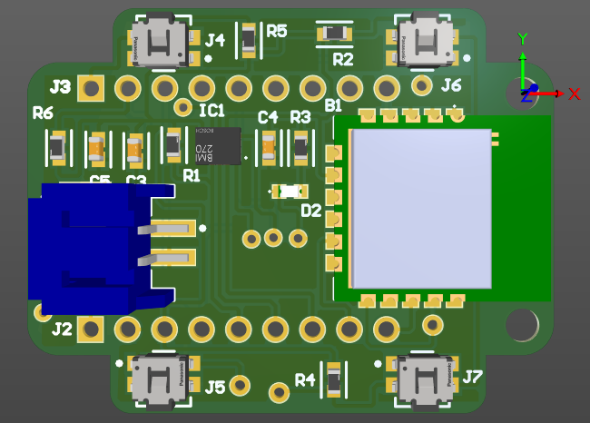

# Carlos Montalvo  
### PCB Design & Embedded Systems Engineer

---

## 🧠 About Me

Electronic Engineering student specialized in **PCB design and embedded hardware development**.  
I design systems from schematic capture to multilayer board layout and validation.

Currently expanding into **IoT architectures and Linux-based environments** to build scalable and connected embedded systems.

---

## 🔧 Core Expertise

- Multilayer PCB Design  
- Schematic Capture & Layout Optimization  
- Sensor Integration (IMU-based systems)  
- Power Management (Battery + Charging ICs)  
- Low-Power Wearable Architectures  
- Embedded C Development  

---

## 🚀 Current Projects

- Compact wearable PCB integrating 6-axis IMU  
- Power management circuit design for portable devices  
- Embedded + IoT integration architecture  
- Linux-based deployment environments  

---

## 🛠 Tools & Technologies

**Hardware & Design**
- KiCad  
- Altium Designer  
- Oscilloscope & Hardware Debugging  

**Software & Systems**
- C (Embedded)
- Linux (Ubuntu)
- Docker
- MATLAB (System Modeling)

---

## 🖼 Featured Hardware Work

---

## 📊 GitHub Activity

---

## 📫 Contact

- LinkedIn: https://linkedin.com/in/TU-USUARIO
- Email: tuemail@correo.com
